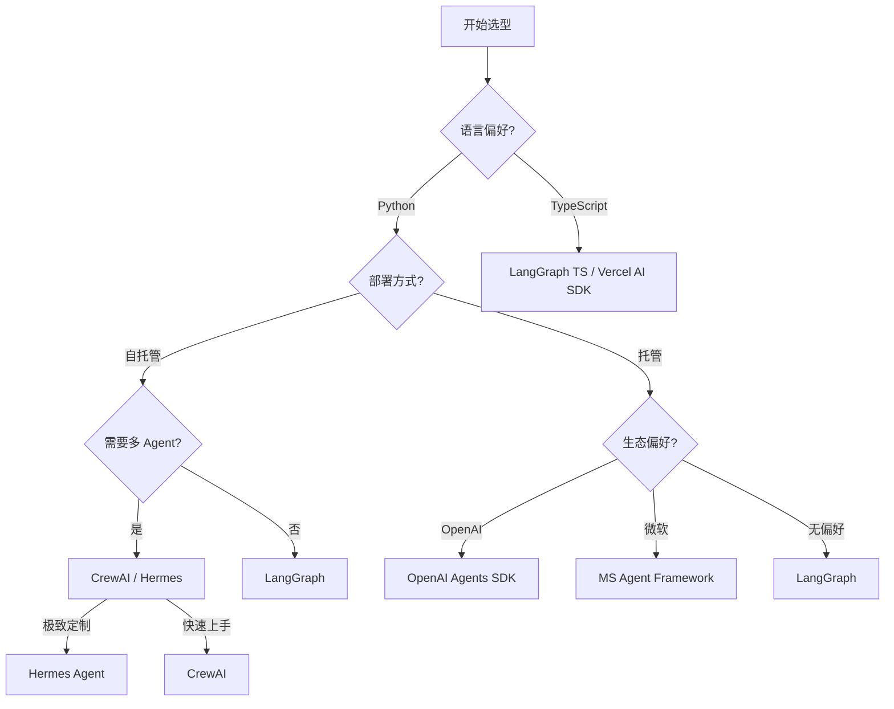

# Agent 框架格局总览 2026

> 2026 年 Agent 框架战争尘埃落定，格局从"百花齐放"走向"三足鼎立 + 开源两极"

## 元数据

- **难度**: ⭐⭐
- **前置知识**: [Agent架构演进](../04-Agent系统架构/01-Agent架构演进.md)
- **关联文件**: [LangGraph与CrewAI实战对比](./02-LangGraph与CrewAI实战对比.md), [OpenAI Agents SDK与MS Agent Framework](./03-OpenAI%20Agents%20SDK与MS%20Agent%20Framework.md), [开源框架Hermes与ClaudeCode](./04-开源框架Hermes与ClaudeCode.md), [Agent协议与通信架构](../04-Agent系统架构/03-Agent协议与通信架构.md)
- **最后更新**: 2026-06-12

---

## 目录

- [1. 2026 重大格局变化](#1-2026-重大格局变化)
  - [1.1 框架版图重绘](#11-框架版图重绘)
  - [1.2 三大商业框架](#12-三大商业框架)
  - [1.3 两大开源先锋](#13-两大开源先锋)
  - [1.4 2026 选型决策矩阵](#14-2026-选型决策矩阵)
- [2. 框架选择原则](#2-框架选择原则)
  - [2.1 不要重复造轮子](#21-不要重复造轮子)
  - [2.2 协议优于框架](#22-协议优于框架)
  - [2.3 2026 趋势](#23-2026-趋势)
- [3. 深度分析](#3-深度分析)
  - [3.1 框架选型决策矩阵对比](#31-框架选型决策矩阵对比)
  - [3.2 选型决策树](#32-选型决策树)
  - [3.3 2026 趋势深入](#33-2026-趋势深入)
  - [3.4 框架迁移与供应商锁定](#34-框架迁移与供应商锁定)
  - [3.5 生产案例研究](#35-生产案例研究)
- [4. Checklist](#4-checklist)
  - [4.1 需求分析](#41-需求分析)
  - [4.2 框架评估](#42-框架评估)
  - [4.3 迁移计划](#43-迁移计划)
  - [4.4 持续演进](#44-持续演进)
- [5. 延伸阅读](#5-延伸阅读)

## 1. 2026 重大格局变化

### 1.1 框架版图重绘

2025-2026 年发生了多个关键事件，彻底改变了 Agent 框架的生态版图：

| 事件 | 时间 | 影响 |
|------|------|------|
| AutoGen 进入维护模式，合并到 Semantic Kernel | 2026-04 | Microsoft Agent Framework GA |
| OpenAI 归档 Swarm，转向 Agents SDK | 2026 | 实验性项目 → 生产级 SDK |
| LangGraph 1.0 GA | 2026 | 最成熟的有向图 Agent 框架 |
| CrewAI 1.0 | 2026 | 角色化多 Agent 协作标杆 |
| Hermes Agent 172k ⭐ | 2026 | 开源 Agent 平台领跑者 |
| OpenClaw 375k+ ⭐ | 2026 | 最大开源 Agent 社区 |
| TypeScript 原生框架爆发 | 2026 | 多个 TS 框架超 20k ⭐ |

### 1.2 三大商业框架

```
商业框架
├── LangGraph（LangChain）
│   ├── 定位：企业级 Agent 编排
│   ├── 特点：有向图工作流、状态管理、人机协同
│   ├── 成熟度：最高（1.0 GA，生态最完整）
│   └── 典型场景：RAG 流水线、多步推理、生产级 Agent
│
├── OpenAI Agents SDK
│   ├── 定位：OpenAI 生态原生 Agent
│   ├── 特点：内置 safety guardrails、managed hosting
│   ├── 前身：Swarm（Archived）
│   └── 典型场景：Deep OpenAI 集成、快速原型
│
└── Microsoft Agent Framework
    ├── 定位：微软生态 Agent 开发平台
    ├── 前身：AutoGen + Semantic Kernel
    ├── 特点：Entra ID 集成、Purview 合规、A2A 支持
    └── 典型场景：企业 Microsoft 365 集成
```

### 1.3 两大开源先锋

```
开源框架
├── Hermes Agent（Nous Research）
│   ├── ⭐ 172k+
│   ├── 定位：通用开源 Agent 平台
│   ├── 特点：Claude/Codex/ACP 兼容、skill-based 架构、MCP 支持
│   └── 适用：自托管、定制化 Agent 系统
│
└── OpenClaw
    ├── ⭐ 375k+
    ├── 定位：最大开源 Agent 社区
    ├── 特点：插件市场、配置文件可移植、企业部署工具
    └── 适用：社区驱动、快速迭代
```

### 1.4 2026 选型决策矩阵

| 需求 | 推荐框架 | 核心理由 |
|------|----------|----------|
| 企业级 RAG + Agent | LangGraph | 成熟度最高，工具链最完善，社区最大 |
| 多 Agent 角色协作 | CrewAI | 角色化设计开箱即用，学习曲线低 |
| Deep OpenAI 集成 | OpenAI Agents SDK | 原生 safety guardrails，托管服务 |
| 微软生态 | MS Agent Framework | Entra ID 身份集成，Purview 合规 |
| 开源自托管 | Hermes Agent | MCP 兼容，skill-based 架构灵活 |
| CLI 开发 Agent | Claude Code | Dynamic Workflows，最强 coding Agent |
| TypeScript 技术栈 | LangGraph TS / Vercel AI SDK | 原生 TS 支持，SSR 友好 |
| 快速原型验证 | CrewAI / OpenAI Agents SDK | 最少代码实现最大功能 |

## 2. 框架选择原则

### 2.1 不要重复造轮子

2026 年的框架已经足够成熟，除非有极端定制需求，否则不应自研 Agent 框架。

### 2.2 协议优于框架

```
正确分层：
  Agent 业务逻辑 → 框架（LangGraph/CrewAI） → 协议（MCP/A2A）

框架是可替换的，协议是基础设施。
选择框架时优先考虑其对 MCP/A2A 的支持程度。
```

### 2.3 2026 趋势

- **框架功能趋同**：所有主流框架都在实现相似的功能集（MCP 支持、A2A 支持、可观测性）
- **差异化在生态**：LangChain 的文档/教程/社区规模，OpenAI 的托管服务，微软的 Entra 集成
- **成本成为变量**：框架 Token 效率、缓存策略、模型级联支持成为选型新维度

## 3. 深度分析

### 3.1 框架选型决策矩阵对比

| 维度 | LangGraph | CrewAI | OpenAI Agents SDK | MS Agent Framework | Hermes Agent |
|------|-----------|--------|-------------------|-------------------|--------------|
| **成熟度** | ⭐⭐⭐⭐⭐ | ⭐⭐⭐⭐ | ⭐⭐⭐⭐ | ⭐⭐⭐ | ⭐⭐⭐⭐ |
| **学习曲线** | 中-高 | 低 | 低-中 | 中 | 中 |
| **语言** | Python/TS | Python | Python | C#/Python | Python/TS |
| **多 Agent 协作** | 有向图 | 角色化 Crew | 内置 | A2A 协议 | skill-based |
| **MCP 支持** | 原生 | 插件 | 原生 | 原生 | 原生 |
| **托管服务** | LangServe | 无 | OpenAI Hosted | Azure | 自托管 |
| **企业合规** | 一般 | 一般 | 有限 | Entra + Purview | 自控 |
| **社区规模** | 最大 | 大 | 中 | 中 | 大 |
| **定价模式** | 开源 + 商业 | 开源 | Pay-as-you-go | Azure 订阅 | 开源 |
| **最佳场景** | 复杂工作流 | 角色化团队 | OpenAI 深度集成 | 微软生态 | 自托管定制 |

### 3.2 选型决策树



### 3.3 2026 趋势深入

**TypeScript 原生框架爆发**

2026 年 TypeScript Agent 框架呈现井喷式增长，多个项目超过 20k ⭐。驱动因素包括：
- Next.js / Vercel 生态的 Agent-first 转向
- Edge Runtime 对低延迟 Agent 的需求
- 前端开发者向 Agent 开发迁移的门槛降低

**MCP 成为基础设施协议**

所有主流框架均已原生支持 MCP（Model Context Protocol），使得工具/资源/提示词可在框架间移植。MCP 支持的完整性成为选型的基本门槛而非差异化优势。

**Agent-as-a-Service 兴起**
- OpenAI Agents SDK 提供托管 Agent 服务
- LangGraph Platform（LangServe）提供企业级部署
- 微软 Agent Service 集成 Azure AI
- 自托管方案仅适合对数据主权有严格要求的场景

### 3.4 框架迁移与供应商锁定

**供应商锁定风险分析**

| 框架 | 锁定因素 | 迁移难度 | 缓解策略 |
|------|----------|----------|----------|
| LangGraph | LangChain 生态 API | 中 | 抽象业务层，使用 MCP 解耦工具 |
| OpenAI Agents SDK | OpenAI 模型依赖 | 高 | 使用 LiteLLM 等适配层 |
| MS Agent Framework | Azure/Entra 绑定 | 高 | 隔离 Microsoft Graph 调用 |
| CrewAI | 角色定义格式 | 低 | 自定义 Agent 基类 |
| Hermes Agent | 自建基础设施 | 中 | 遵循 ACP 协议标准 |

**迁移模式建议**

1. **协议驱动架构**：业务逻辑通过 MCP/A2A 协议通信，框架仅作为编排层
2. **分层抽象**：将 Agent 逻辑、工具调用、状态管理分为独立层
3. **渐进式迁移**：先迁移非核心 Agent，验证后再迁移核心业务

### 3.5 生产案例研究

**案例 A：某金融科技企业 RAG 系统**
- 选型：LangGraph
- 规模：200+ Agent 节点，日均处理 50 万查询
- 关键指标：响应时间 < 2s，准确率 97.3%
- 经验：状态管理是最大挑战，建议使用 Redis 持久化

**案例 B：SaaS 初创公司的客服多 Agent 系统**
- 选型：CrewAI
- 规模：5 个角色化 Agent（分类、检索、生成、质检、升级）
- 关键指标：客户满意度提升 34%，首次解决率提升 28%
- 经验：角色定义需要迭代，建议从 3 个角色开始

**案例 C：大模型的 CLI 开发 Agent**
- 选型：Hermes + Claude Code
- 规模：单人开发者的日常辅助
- 关键指标：开发效率提升 3-5 倍
- 经验：skill-based 架构的复用价值远大于单次编写

## 4. Checklist

### 4.1 需求分析
- [ ] 明确 Agent 的核心使用场景（RAG / 多 Agent 协作 / 代码生成 / 客服等）
- [ ] 确定技术栈偏好（Python / TypeScript / C#）
- [ ] 评估部署环境（云端托管 / 自托管 / 混合）
- [ ] 确认合规与安全需求（数据主权 / 身份认证 / 审计日志）
- [ ] 估算预期负载与并发规模
- [ ] 定义成功指标（延迟 / 准确率 / 成本预算）

### 4.2 框架评估
- [ ] 对照决策矩阵筛选 2-3 个候选框架
- [ ] 构建 PoC 验证核心场景（1-2 周）
- [ ] 评估 MCP/A2A 协议兼容性
- [ ] 检查社区活跃度与长期维护可能性
- [ ] 验证企业级特性（可观测性 / 错误恢复 / 版本管理）
- [ ] 计算 TCO（框架成本 + 基础设施 + 运维人力）

### 4.3 迁移计划
- [ ] 设计协议驱动的分层架构（业务 / 编排 / 协议）
- [ ] 制定渐进式迁移路线图（非核心 → 核心）
- [ ] 建立回归测试基准
- [ ] 规划回滚方案
- [ ] 培训团队掌握新框架

### 4.4 持续演进
- [ ] 跟踪框架版本更新与 breaking changes
- [ ] 定期评估框架生态健康状况（Commits / Issues / Contributors）
- [ ] 维护 MCP 工具库的框架无关性
- [ ] 每季度复盘选型决策
- [ ] 关注新兴框架与协议标准

## 5. 延伸阅读

### 本目录关联文件
- [LangGraph与CrewAI实战对比](./02-LangGraph与CrewAI实战对比.md)
- [OpenAI Agents SDK与MS Agent Framework](./03-OpenAI%20Agents%20SDK与MS%20Agent%20Framework.md)
- [开源框架Hermes与ClaudeCode](./04-开源框架Hermes与ClaudeCode.md)
- [Agent架构演进](../04-Agent系统架构/01-Agent架构演进.md)
- [Agent协议与通信架构](../04-Agent系统架构/03-Agent协议与通信架构.md)

### 外部资源
- [LangGraph 官方文档](https://langchain-ai.github.io/langgraph/)
- [OpenAI Agents SDK 指南](https://platform.openai.com/docs/guides/agents)
- [MCP 协议规范](https://modelcontextprotocol.io/)
- [CrewAI 官方文档](https://docs.crewai.com/)
- [A2A Agent-to-Agent 协议](https://github.com/google/A2A)
