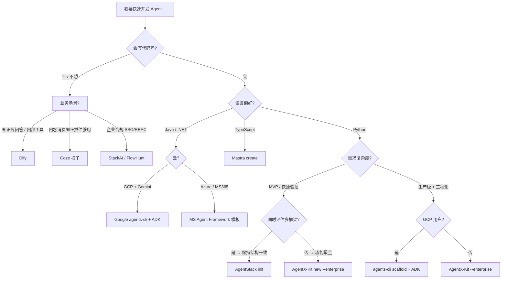

# Agent 脚手架与快速启动工具生态

> AgentStack 不是框架，是 create-react-app 级别的项目脚手架——本篇梳理 2026 年 A 类（脚手架 CLI）与 B 类（快速启动框架）的完整格局

## 元数据
- **难度**: ⭐⭐
- **前置知识**: [[01-框架格局总览2026]], [[02-LangGraph与CrewAI实战对比]]
- **关联文件**: [[01-框架格局总览2026]], [[02-LangGraph与CrewAI实战对比]], [[03-OpenAI Agents SDK与MS Agent Framework]], [[06-生产级框架选型批判性决策指南]]
- **最后更新**: 2026-08-14

---

## 目录
- [1. 核心概念澄清：框架 vs 脚手架](#1-核心概念澄清框架-vs-脚手架)
- [2. A 类：最接近 AgentStack 的脚手架 CLI 工具](#2-a-类最接近-agentstack-的脚手架-cli-工具)
  - [2.1 AgentStack（原生命名工具）](#21-agentstack原生命名工具)
  - [2.2 AgentX-Kit（功能最全的竞争者）](#22-agentx-kit功能最全的竞争者)
  - [2.3 Google agents-cli（全生命周期 GCP 原生）](#23-google-agents-cli全生命周期-gcp-原生)
  - [2.4 Mastra（TS-First 脚手架 + 框架二合一）](#24-mastrats-first-脚手架--框架二合一)
  - [2.5 Bee AgentStack（A2A 协议原生，Linux Foundation 托管）](#25-bee-agentstacka2a-协议原生linux-foundation-托管)
  - [2.6 A 类横向对比表](#26-a-类横向对比表)
- [3. B 类：自带快速启动能力的框架](#3-b-类自带快速启动能力的框架)
  - [3.1 快速启动框架速览](#31-快速启动框架速览)
  - [3.2 2026 新增框架（Pydantic AI / smolagents / Claude Agent SDK / Google ADK）](#32-2026-新增框架pydantic-ai--smolagents--claude-agent-sdk--google-adk)
- [4. C 类：低代码 / 无代码可视化平台](#4-c-类低代码--无代码可视化平台)
  - [4.1 Dify（开源标杆）](#41-dify开源标杆)
  - [4.2 Coze / 扣子（字节跳动）](#42-coze--扣子字节跳动)
  - [4.3 FlowHunt、StackAI（企业级）](#43-flowhuntstackai企业级)
- [5. 选型决策树](#5-选型决策树)
- [6. 深度分析](#6-深度分析)
  - [6.1 脚手架到底能不能生成"生产就绪"项目？](#61-脚手架到底能不能生成生产就绪项目)
  - [6.2 框架锁定 vs 脚手架锁定：哪一种更危险？](#62-框架锁定-vs-脚手架锁定哪一种更危险)
- [7. Checklist](#7-checklist)
- [8. 延伸阅读](#8-延伸阅读)

---

## 1. 核心概念澄清：框架 vs 脚手架

这是选型时最容易混淆的概念，必须分清：

```
Agent 开发技术栈分层（从下往上）：

┌─────────────────────────────────────┐
│ C 层：低代码平台（Dify / Coze）       │  拖拽就能搭，非技术友好
├─────────────────────────────────────┤
│ A 层：脚手架 CLI（AgentStack 等）     │  一条命令 → 完整项目骨架
├─────────────────────────────────────┤
│ B 层：Agent 框架（LangGraph / CrewAI）│  编排、状态、工具调用抽象
├─────────────────────────────────────┤
│ 底层：LLM API + Function Calling     │  原生能力，不依赖任何框架
└─────────────────────────────────────┘
```

| 维度 | Agent 框架 | 脚手架 CLI |
|------|-----------|-----------|
| **角色** | 定义 Agent 如何思考/执行/协作 | 把框架和依赖一次性配置好 |
| **类比** | React / Vue | create-react-app / Vite |
| **运行时** | 生产运行时依赖 | 只在开发初始化时用一次 |
| **锁定风险** | 高（运行时深度绑定） | 低（用完即可脱离） |
| **代表** | LangGraph, CrewAI, MAF | AgentStack, AgentX-Kit, agents-cli |

> [!warning] 常见陷阱
> 不要把"脚手架生成的项目骨架"等同于"生产就绪系统"。脚手架只能保证目录结构、依赖版本、示例代码不冲突。耐久状态、错误重试、可观测性、RBAC、成本治理等生产能力必须由团队自行补完。

---

## 2. A 类：最接近 AgentStack 的脚手架 CLI 工具

### 2.1 AgentStack（原生命名工具）

**定位**：AI Agent 领域的 `create-react-app`。一条命令跨框架生成标准化骨架。

| 项目 | 详情 |
|------|------|
| 安装方式 | `curl` / `brew` / `pipx` / `uv` |
| 支持框架 | CrewAI, LangGraph, OpenAI Swarms, LlamaStack |
| 核心命令 | `agentstack init`（初始化） / `agentstack generate`（增 Agent/Task） / `agentstack tools add`（加工具） / `agentstack run`（运行） |
| LLM 接入 | 内置 LiteLLM，可切换 OpenAI/Anthropic/Google/开源模型 |
| 可观测性 | 内置 AgentOps 监控 |
| 项目结构约定 | YAML 配置（agent/task）统一，跨框架结构一致 |
| 适用 | 同时评估多个框架、想保持项目结构一致的团队 |

**限制**：只支持 4 个框架；没有 GUI；社区版无商业支持。

---

### 2.2 AgentX-Kit（功能最全的竞争者）

**定位**：provider 无关的交互式脚手架，功能明显多于 AgentStack，**含企业级模板和可视化 dashboard**。

| 项目 | 详情 |
|------|------|
| PyPI 包名 | `agentx-kit`，CLI 命令 `agentx` |
| 支持框架 | LangChain, CrewAI（结构化分层布局 nodes/state/schemas/prompts/utils） |
| LLM providers | 12 个：OpenAI/Azure/OpenRouter/Anthropic/Gemini/Vertex/Bedrock/Groq/Ollama/HF/Cohere/Mistral |
| 核心命令 | `agentx new`（交互式向导）/ `--enterprise`（生产模板：tracing/guardrails/FastAPI/Docker/CI/evals/caching）/ `agentx validate` / `agentx upgrade` / `agentx flow --ui`（2D/3D 流程图） |
| 多 Agent 编排 | 可选 supervisor / sequential / parallel；支持子 Agent swarm |
| 额外功能 | RAG upload/build/list、Voice I/O（faster-whisper + edge-tts）、dashboard（Prompt 调优 UI）、MCP 服务器模式（供 Claude Code/Cursor 调用）、缓存、静态 AST + runtime 函数调用 DAG |
| 环境管理 | 生成的项目自带 `uv` 虚拟环境，开箱即运行 |

> [!tip] 推荐场景
> 如果你本来想用 AgentStack 但嫌它能力太薄，AgentX-Kit 是第一备选。尤其当你需要**企业级模板（CI/Docker/评估/缓存）**或**交互式调试 dashboard** 时。

---

### 2.3 Google agents-cli（全生命周期 GCP 原生）

**定位**：Google Cloud 官方 CLI，把 Agent 全生命周期（脚手架 → 开发 → 评估 → 部署 → 发布）浓缩成一条命令流。

| 项目 | 详情 |
|------|------|
| 核心底座 | Google ADK（Agent Development Kit） + A2A（Agent-to-Agent）协议 |
| 7 大技能模块 | Workflow / ADK Code / Scaffold / Eval / Deploy / Publish / Observability |
| scaffold 命令 | ① 新建标准化项目 ② 给现有项目追加部署/CI/CD/RAG 能力 ③ 升级项目到新版规范 |
| 本地调试 | `agents-cli run`（冒烟测试）/ `agents-cli playground`（Web 可视化交互） |
| 评估验证 | `eval run`（评估流水线） / `eval compare`（版本对比，支持 LLM-as-Judge） |
| 部署目标 | Agent Runtime / Cloud Run（无服务器容器） / GKE（K8s 集群） |
| 企业发布 | `publish gemini-enterprise` 注册到组织内 Gemini 平台 |
| 基础设施 | `infra` 系列命令 → Terraform 配置 + staging/prod CI/CD + 向量存储 |
| 本地开发门槛 | 只要 AI Studio API Key 即可启动原型，无需 GCP 项目 |

> [!note] 场景边界
> 非 GCP/Gemini 用户不建议选。但如果你是 **Google Cloud 企业用户**，这是 2026 年工程化最完整的一条龙工具链——没有同类工具覆盖 从 scaffold 到 Gemini Enterprise 发布 的闭环。

---

### 2.4 Mastra（TS-First 脚手架 + 框架二合一）

**定位**：TypeScript 原生的 Agent 框架，通过 `npm create mastra@latest` 一条命令创建完整项目，是 **TS 全栈开发者**的首选。

| 项目 | 详情 |
|------|------|
| 脚手架命令 | `npm create mastra@latest <project-name> -- --llm <provider>` |
| 模型格式 | `provider/model`（如 `openai/gpt-5.6-sol`），自动根据字符串读取 provider 对应环境变量 |
| Agent 定义 | `new Agent({ id, name, instructions, model, tools })` |
| Tool 定义 | 必须用 `createTool({ id, description, inputSchema: zod, outputSchema, execute() })`（纯对象定义不执行） |
| 工作流 | `.then()`（顺序）/ `.parallel()`（并发）/ `.branch()`（条件路由） |
| 额外能力 | 持久记忆、跨 provider 模型路由、流式响应、Voice、MCP、tracing |

---

### 2.5 Bee AgentStack（A2A 协议原生，Linux Foundation 托管）

**定位**：另一个名为 "Agent Stack" 的开源项目，但方向不同——不是脚手架，而是**运行时平台**，基于 Agent2Agent（A2A）协议，Linux Foundation 托管，避免厂商锁定。

| 项目 | 详情 |
|------|------|
| 核心能力 | LLM 路由 + 向量存储 + HTTP 暴露 Agent + 本地/自有环境运行 |
| 设计哲学 | 不绑定任何框架/厂商，A2A 协议让 Agent 可互操作 |
| 适用 | 构建 agent-first 功能、需将 agent 作为 HTTP 服务嵌入现有 App、且不想从 0 搭部署基础设施的团队 |
| 与 CLI AgentStack 的关系 | 同名但完全不同的两个项目（GitHub 仓库 owner 不同），选型时注意区分 |

---

### 2.6 A 类横向对比表

| 工具 | 一条命令 | 支持框架 | 语言 | 企业级模板 | Dashboard UI | 部署流水线 | 模型 Provider 数 |
|------|---------|---------|------|-----------|-------------|-----------|----------------|
| **AgentStack** | `agentstack init` | CrewAI, LangGraph, Swarms, LlamaStack | Python | 无 | 无 | 无 | 全（LiteLLM） |
| **AgentX-Kit** | `agentx new --enterprise` | LangChain, CrewAI | Python | ✅ Tracing/Guardrails/FastAPI/Docker/CI/Evals/Cache | ✅ Prompt 调优 UI | Docker/CI 模板 | 12 |
| **Google agents-cli** | `agents-cli scaffold` | Google ADK | Python/Java | Terraform/CI/CD/RAG | ✅ playground | ✅ Cloud Run/GKE + Gemini Enterprise 发布 | GCP 全家桶 |
| **Mastra** | `npm create mastra@latest` | Mastra 自有 | TS | 基础模板 | 开发服务内置 | 标准 Vercel/Docker | 多 Provider 路由 |
| **Bee AgentStack** | 自定义 | A2A 生态 | Python | Helm/K8s | 内置 UI | ✅ Helm 部署 | 多路由 |

---

## 3. B 类：自带快速启动能力的框架

### 3.1 快速启动框架速览

这些框架本身就是开发底座，但它们各自提供了"快速启动"的方式（`pip install` 后 5-10 行代码跑通 demo）。完整对比见 [[01-框架格局总览2026]] 和 [[02-LangGraph与CrewAI实战对比]]。

| 框架 | 启动难度 | 启动速度 | 最适合快速开发的场景 |
|------|---------|---------|---------------------|
| CrewAI | 低 | 5 行代码 | 角色化多 Agent MVP |
| OpenAI Agents SDK | 低 | 3 个对象（Agent+Handoff+Guardrails） | OpenAI 生态快速原型 |
| smolagents（HuggingFace） | 最低 | CodeAgent / ToolCallingAgent 2 行 | 学习 agent 原理、极简脚本 |
| Pydantic AI | 低 | 类型安全 + FastAPI 天然兼容 | Python 开发者、已有 FastAPI 技术栈 |
| Mastra | 低 | TS 原生，SSR 友好 | Next.js 全栈 |
| LlamaIndex Workflows | 中 | RAG 检索型 agent 最快 | 知识库问答 |
| Microsoft Agent Framework | 中 | .NET 企业栈友好 | Azure/AAD 集成 |
| LangGraph | 高 | 需定义 State+Node+Edge 三样 | 复杂流程，生产耐用 |

---

### 3.2 2026 新增框架（Pydantic AI / smolagents / Claude Agent SDK / Google ADK）

#### Pydantic AI

**定位**：Pydantic 官方出品，**类型安全**是最大卖点。输入/工具/输出全部基于 Pydantic Schema，天然适合 FastAPI / Pydantic 技术栈团队。

| 维度 | 评价 |
|------|------|
| 输入/输出类型 | ✅ 全部基于 Pydantic，类型检查无运行时惊喜 |
| 与 FastAPI 集成 | ✅ 天然兼容，几乎 0 胶水代码 |
| Agent 抽象 | 简洁：`Run` 对象 + `Model` + `Tool` |
| 适用 | Python 开发者、已用 Pydantic 的后端团队 |
| 短板 | 多 Agent 编排能力弱于 LangGraph/CrewAI |

#### smolagents（HuggingFace）

**定位**：HuggingFace 官方极简 agent 库。代码量极少、学习成本最低。

| 维度 | 评价 |
|------|------|
| 核心理念 | "最小可用 agent"，只封装最基础推理循环 |
| 代码量 | 一个 CodeAgent 类 + Tool 装饰器即可开工 |
| 适合场景 | 理解 agent 原理、写一次性脚本、教学 |
| 短板 | 没有多 Agent、没有持久化、不可上生产——但学习曲线是平的 |

#### Claude Agent SDK（Anthropic）

**定位**：Anthropic 官方 agent 框架，和 Claude Code CLI 使用同一套 harness。**编码 agent 和安全优先**场景的首选。

| 维度 | 评价 |
|------|------|
| 模型优先 | 深度适配 Claude 系列（Sonnet/Opus/Haiku） |
| 安全性 | 安全护栏是原生优先设计，而非插件 |
| 编码能力 | 和 Claude Code 共享执行 harness，编码 agent 效果突出 |
| 短板 | 非 Anthropic 模型支持一般，存在一定厂商锁定 |

#### Google ADK（Agent Development Kit）

**定位**：Google Cloud 云原生 agent 开发套件，Gemini 深度适配，**Java/Python 双语**支持，原生 A2A 协议。

| 维度 | 评价 |
|------|------|
| Gemini 适配 | ✅ 最优。Google 自家集成最深 |
| 云部署流水线 | ✅ 完整（配合 agents-cli 使用） |
| 评估体系 | ✅ 内置 eval 流水线（LLM-as-Judge + 轨迹评分） |
| 语言支持 | Python + Java，Java 开发者稀缺选项 |
| 短板 | 第三方模型适配一般，重度绑定 GCP |

---

## 4. C 类：低代码 / 无代码可视化平台

当团队**非技术人员占比高**或**内部工具不需要定制开发**时，直接跳过 A/B 两层，用可视化平台通常是效率最高的选择。

### 4.1 Dify（开源标杆）

国内最受欢迎的开源智能体平台之一，阿里系支持。模块化架构，内置文档解析→向量化→语义检索全流程。

| 特点 | 说明 |
|------|------|
| 开源 | ✅ 可私有化部署 |
| 可视化画布 | ✅ agent 工作流拖拽编排 |
| 知识库 RAG | ✅ 开箱即用，文档解析全流程内置 |
| 混合开发 | ✅ 低代码 + 代码混合模式（Dify as Backend + 自定义前端） |
| 适用 | 快速搭建私有知识库问答、内部自动化工具、不想写框架代码的团队 |

### 4.2 Coze / 扣子（字节跳动）

| 特点 | 说明 |
|------|------|
| 完全视觉化 | 不需要写代码，插件 60+ 种（资讯/旅行/办公/多模态等） |
| 架构 | 微服务架构，后端 Go，前端 React + TS |
| 私有化部署 | ✅ 支持 |
| 适用 | 非技术团队、业务部门自己搭 agent、内容消费类场景 |

### 4.3 FlowHunt、StackAI（企业级）

| 平台 | 亮点 |
|------|------|
| FlowHunt | 1400+ 原生集成（无需写 API wrapper）、可视化画布、生产基础设施直接托管。比框架开发快 10x。 |
| StackAI | 企业合规优先：SSO/RBAC/审计日志/PII 脱敏/数据驻留。SharePoint/Confluence/Notion/Salesforce 等企业数据源。 |

---

## 5. 选型决策树



---

## 6. 深度分析

### 6.1 脚手架到底能不能生成"生产就绪"项目？

**诚实答案：不能。** 只能生成"生产就绪的骨架"。区别如下：

| 维度 | 脚手架能替你做 | 必须自己补完 |
|------|--------------|-------------|
| 目录结构 | ✅ 标准分层 + 示例 | ❌ 根据业务调整模块边界 |
| 依赖版本 | ✅ 锁定兼容版本 | ❌ 升级策略 + 冲突测试 |
| 示例 agent | ✅ 1-2 个 Hello World | ❌ 真实业务逻辑 + 边界 case |
| 环境变量 | ✅ .env.example | ❌ 密钥管理（Vault/KMS）|
| 可观测性 | ✅ AgentOps / LangSmith 接入 | ❌ OTel 规范、告警、SLO |
| 耐久状态 | ❌ 几乎全部不做 | ❌ checkpoint + 断点恢复 + 幂等 |
| 错误重试 | ❌ 不做 | ❌ 指数退避 + 电路熔断 + 降级策略 |
| 评估 | ❌ 不做 | ❌ eval 数据集 + 回归基线 + PR 门禁 |
| 安全/RBAC | ❌ 不做 | ❌ 身份认证 + 权限控制 + Prompt 注入防护 |

> [!important] 红线提醒
> 当你跑 `agentstack init` 或 `agentx new --enterprise` 看到"✅ 项目已生成"时，**实际只完成了生产部署工作的 15%**。剩余 85% 是上面右列的内容。别把脚手架的完成度错当系统完成度。

### 6.2 框架锁定 vs 脚手架锁定：哪一种更危险？

| 锁定类型 | 触发条件 | 迁移难度 | 缓解策略 |
|---------|---------|---------|---------|
| **框架锁定**（LangGraph） | 业务逻辑直接调用 StateGraph/Node/Checkpoint API | **高**——执行模型不同，重写成本 60-90% | 业务逻辑放在独立 service 层，框架只做编排，状态通过 MCP/A2A 传递 |
| **框架锁定**（CrewAI） | 角色定义、Task description 使用 CrewAI 结构 | **中**——声明式结构可手动迁移到 YAML/JSON | 自定义 Agent/Task 基类，隔离框架 API |
| **脚手架锁定**（AgentStack） | 依赖 agentstack CLI 的 generate/tools add 命令 | **低**——退出成本几乎为 0，就是个普通项目 | 生成后停止使用 CLI，直接改代码即可 |
| **脚手架锁定**（AgentX-Kit） | 用 `--enterprise` 生成的 FastAPI/Docker/CI 模板 | **中低**——模板是可脱离的，但 upgrade 命令会失效 | 升级前先 git diff，看变更是否想接受 |

结论：**脚手架锁定风险远低于框架锁定**。用哪个脚手架差别不大，但选哪个框架决定了未来 1-2 年的架构迁移成本。所以选脚手架可以随意一点，选框架必须严肃。

---

## 7. Checklist

### 选型前必问
- [ ] 明确技术栈（Python / TS / Java / 不写代码），这是第一分流点
- [ ] 区分「我要的是脚手架」还是「我要的是框架」，两者选型标准完全不同
- [ ] 脚手架一次性用完就脱离吗？还是计划长期用 CLI 的 generate/upgrade 命令？
- [ ] 团队能否接受"骨架完成 ≠ 生产就绪"的 85% 差距？
- [ ] 是否有 GCP / Azure / OpenAI 单一厂商绑定倾向？→ 直接用对应官方 CLI
- [ ] 脚手架生成的目录结构和现有项目规范是否冲突？
- [ ] 低代码平台能不能满足需求？如果能，为什么要写代码？

### 落地执行
- [ ] 先脚手架生成 1 个最小项目，跑通 demo，再评估
- [ ] 生成后立即独立运行一次（不依赖脚手架 CLI），验证无锁定
- [ ] 6 个月内是否有框架切换计划？如果有，脚手架生成的项目结构在目标框架下可复用多少？
- [ ] 给团队明确：脚手架省的是"配置时间"，不是"架构设计时间"

---

## 8. 延伸阅读

### 本目录关联
- [[01-框架格局总览2026]] — 框架版图全景
- [[02-LangGraph与CrewAI实战对比]] — 框架级（非脚手架）深度对比
- [[03-OpenAI Agents SDK与MS Agent Framework]] — 商业框架
- [[04-开源框架Hermes与ClaudeCode]] — 开源先锋
- [[06-生产级框架选型批判性决策指南]] — 用 Fool 五模式挑战"谁最好"的惯性思维

### 跨目录关联
- [[Agent协议与通信架构]] — MCP/A2A 协议，降低框架/脚手架锁定的基础设施
- [[01-AI开发框架选型指南|../../../AI应用工程师知识库/06-工具与框架/01-AI开发框架选型.md]] — 应用工程师视角的选型
- [[Agent架构演进]] — 理解为什么框架/脚手架分层是合理架构

### 外部资源
- [AgentStack 官方站点](https://agentstack.sh/)
- [AgentX-Kit 文档](https://muhammadyahiya.github.io/agentx-kit/)
- [Mastra 文档](https://mastra.ai/docs)
- [Dify GitHub](https://github.com/langgenius/dify)
- [A2A 协议（Google）](https://github.com/google/A2A)
