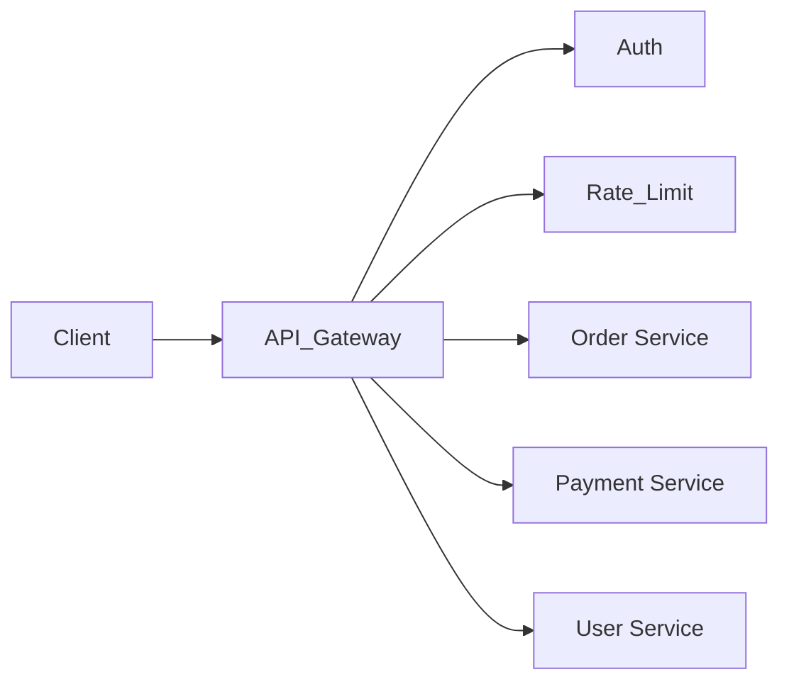

# 微服务架构

> 微服务架构将单体应用拆分为多个独立部署的小服务，每个服务围绕特定业务能力构建，通过轻量级通信机制协作。

---

## 目录

1. [微服务核心概念](#1-微服务核心概念)
2. [服务拆分原则](#2-服务拆分原则)
3. [服务通信](#3-服务通信)
4. [API网关](#4-api网关)
5. [服务治理](#5-服务治理)
6. [微服务挑战](#6-微服务挑战)

---

## 1. 微服务核心概念

### 1.1 微服务定义

- **独立部署**：每个服务可独立发布
- **业务能力**：围绕业务领域建模
- **去中心化**：各自选择技术栈
- **数据自治**：每个服务拥有独立数据库

### 1.2 微服务 vs 单体

| 维度 | 单体 | 微服务 |
|------|------|--------|
| 部署 | 单部署单元 | 多独立部署 |
| 扩展 | 整体扩展 | 精细扩展 |
| 开发 | 单代码库 | 多代码库 |
| 故障 | 单点影响全局 | 隔离在单个服务 |
| 团队 | 大团队协作 | 小团队自治 |
| 复杂度 | 代码复杂度高 | 基础设施复杂度高 |

---

## 2. 服务拆分原则

### 2.1 领域驱动设计（DDD）驱动

```
业务领域 → 子域 → 限界上下文 → 微服务
```

**拆分策略：**
- 按业务能力：订单、支付、库存、用户
- 按子域：核心域、支撑域、通用域
- 按变更频率：高频变动的独立服务

### 2.2 拆分粒度

| 粒度 | 优点 | 缺点 |
|------|------|------|
| 粗粒度 | 通信少，事务简单 | 内聚不足 |
| 细粒度 | 独立性强 | 通信成本高，分布式复杂 |

**经验法则：** 一个服务可以由6-8人小团队维护。

---

## 3. 服务通信

### 3.1 同步通信（gRPC）

```protobuf
service OrderService {
    rpc CreateOrder(CreateOrderRequest) returns (OrderResponse);
    rpc GetOrder(GetOrderRequest) returns (OrderResponse);
}
```

### 3.2 异步通信（消息队列）

```python
# 事件发布
def create_order(order):
    # ... 业务逻辑
    event_bus.publish("order.created", {
        "order_id": order.id,
        "user_id": order.user_id,
        "amount": order.total
    })

# 事件消费（库存服务）
@event_bus.subscribe("order.created")
def handle_order_created(event):
    inventory_service.reserve(event.order_id, event.items)
```

### 3.3 通信模式对比

| 模式 | 耦合度 | 延迟 | 可靠性 | 适用 |
|------|--------|------|--------|------|
| REST | 中 | 中 | 中 | 查询API |
| gRPC | 强 | 低 | 中 | 服务间高频调用 |
| 消息队列 | 弱 | 高 | 高 | 事件驱动 |
| 事件流 | 极弱 | 高 | 高 | 数据管道 |

---

## 4. API网关

### 4.1 网关职责



| 功能 | 说明 |
|------|------|
| 路由 | 请求转发到对应服务 |
| 认证 | 统一身份验证 |
| 限流 | 防止过载 |
| 熔断 | 下游故障时快速失败 |
| 日志 | 统一请求日志 |

### 4.2 网关选型

| 网关 | 语言 | 特点 |
|------|------|------|
| Kong | Lua/Go | 插件丰富，企业级 |
| APISIX | Lua/Go | 高性能，云原生 |
| Envoy | C++ | L7代理，服务网格数据面 |
| Traefik | Go | 自动发现K8s服务 |

---

## 5. 服务治理

### 5.1 服务发现

| 模式 | 描述 | 实现 |
|------|------|------|
| 客户端发现 | 客户端直接查询注册表 | Netflix Eureka |
| 服务端发现 | 负载均衡器查询 | AWS ALB, Consul |
| Service Mesh | Sidecar代理发现 | Istio, Linkerd |

### 5.2 负载均衡策略

| 策略 | 描述 | 适用 |
|------|------|------|
| 轮询 | 依次分发 | 同质服务 |
| 最小连接 | 发给连接数最少的 | 长连接服务 |
| 加权 | 按权重分配 | 异构实例 |
| 一致性哈希 | 按key路由 | 缓存亲和性 |

### 5.3 熔断与降级

**三状态熔断器：**
```
Closed（正常）→ Open（故障）→ Half-Open（尝试恢复）
```

```python
# 熔断器模式
class CircuitBreaker:
    def __init__(self, threshold=5, timeout=30):
        self.failures = 0
        self.threshold = threshold
        self.timeout = timeout
        self.state = "CLOSED"

    def call(self, func):
        if self.state == "OPEN":
            if time_since_last_failure > self.timeout:
                self.state = "HALF_OPEN"
            else:
                raise CircuitBreakerOpen()

        try:
            result = func()
            self.failures = 0
            self.state = "CLOSED"
            return result
        except Exception:
            self.failures += 1
            if self.failures >= self.threshold:
                self.state = "OPEN"
            raise
```

---

## 6. 微服务挑战

### 6.1 分布式事务

| 模式 | 描述 | 示例 |
|------|------|------|
| Saga | 补偿事务序列 | 跨服务订单流程 |
| TCC | Try-Confirm-Cancel | 账户资金操作 |
| Outbox | 本地事务+消息表 | 可靠事件发布 |

### 6.2 数据一致性

**Eventual Consistency + 补偿机制：**
- 设计幂等操作（idempotency key）
- 使用Saga编排/编排
- 处理最终一致性的UI提示

### 6.3 测试挑战

| 测试层级 | 范围 | 工具 |
|---------|------|------|
| 单元测试 | 单个服务 | JUnit, pytest |
| 契约测试 | 服务间接口 | Pact, Spring Cloud Contract |
| 集成测试 | 多个服务 | Testcontainers |
| 端到端测试 | 全链路 | Cypress, Playwright |

---

## 延伸阅读

- *Building Microservices* (Sam Newman) — 微服务经典
- *Microservices Patterns* (Chris Richardson) — 微服务设计模式
- *Cloud Native Patterns* (Cornelia Davis) — 云原生模式
- 微服务参考架构: https://microservices.io/

---

*最后更新：2026-06-15*
