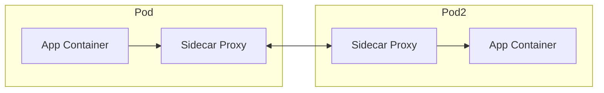

# 服务网格

> 服务网格（Service Mesh）是基础设施层，处理服务间通信，将流量管理、安全、可观测性从应用代码中抽离到Sidecar代理。

---

## 目录

1. [服务网格概述](#1-服务网格概述)
2. [Istio架构](#2-istio架构)
3. [流量管理](#3-流量管理)
4. [安全](#4-安全)
5. [可观测性](#5-可观测性)
6. [服务网格选型](#6-服务网格选型)

---

## 1. 服务网格概述

### 1.1 为什么需要服务网格

随着微服务数量增长，通信复杂性指数级上升：

- 重试、超时、熔断
- 负载均衡、灰度发布
- 认证、授权、加密
- 监控、追踪、日志

服务网格将这些统一到基础设施层。

### 1.2 Sidecar模式



**好处：**
- 应用无需感知网络
- 语言无关
- 独立升级
- 统一控制

### 1.3 数据面 vs 控制面

| 层面 | 功能 | 组件 |
|------|------|------|
| 数据面 | 处理服务间流量 | Envoy, Linkerd-proxy |
| 控制面 | 下发配置和策略 | Istiod, Linkerd-control |

---

## 2. Istio架构

### 2.1 核心组件

```
控制面 (istiod)
├── Pilot: 服务发现 + 流量管理
├── Citadel: 证书签发 + 安全
└── Galley: 配置验证 + 分发
         ↓
数据面 (Envoy Sidecar)
各Pod中的Envoy代理
```

### 2.2 流量劫持

```
请求 → iptables规则 → 重定向到Envoy(15000)
     → Envoy决定路由 → 转发到目标服务
     → 目标Pod Envoy接收 → iptables还原 → 应用容器
```

---

## 3. 流量管理

### 3.1 虚拟服务（VirtualService）

```yaml
apiVersion: networking.istio.io/v1beta1
kind: VirtualService
spec:
  hosts:
  - reviews
  http:
  - match:
    - headers:
        end-user:
          exact: jason
    route:
    - destination:
        host: reviews
        subset: v2
  - route:
    - destination:
        host: reviews
        subset: v1
```

### 3.2 目标规则（DestinationRule）

```yaml
apiVersion: networking.istio.io/v1beta1
kind: DestinationRule
spec:
  host: reviews
  trafficPolicy:
    loadBalancer:
      simple: ROUND_ROBIN
    connectionPool:
      tcp:
        maxConnections: 100
  subsets:
  - name: v1
    labels:
      version: v1
  - name: v2
    labels:
      version: v2
```

### 3.3 灰度发布策略

| 策略 | VirtualService配置 | 流量比例 |
|------|-------------------|----------|
| 金丝雀 | 90% v1 + 10% v2 | 逐步增加 |
| 蓝绿 | 100% 切换 | 瞬间切换 |
| A/B测试 | 按header分流 | 条件路由 |

---

## 4. 安全

### 4.1 mTLS

网格内所有服务间通信自动加密：

```yaml
apiVersion: security.istio.io/v1beta1
kind: PeerAuthentication
spec:
  mtls:
    mode: STRICT  # STRICT | PERMISSIVE | DISABLE
```

### 4.2 授权策略

```yaml
apiVersion: security.istio.io/v1beta1
kind: AuthorizationPolicy
spec:
  selector:
    matchLabels:
      app: products
  rules:
  - from:
    - source:
        principals: ["cluster.local/ns/default/sa/frontend"]
    to:
    - operation:
        methods: ["GET"]
```

---

## 5. 可观测性

### 5.1 内置能力

| 维度 | 数据来源 | 工具 |
|------|----------|------|
| 指标 | Envoy metrics | Prometheus + Grafana |
| 日志 | Envoy access log | Loki / ELK |
| 追踪 | Envoy tracing | Jaeger / Zipkin |

### 5.2 Kiali可视化

Kiali 提供服务网格的拓扑可视化、健康检查和流量监控。

---

## 6. 服务网格选型

| 维度 | Istio | Linkerd | Consul Connect |
|------|-------|---------|----------------|
| 架构 | Envoy数据面 | 轻量代理 | Envoy |
| 功能 | 最丰富 | 简洁 | 中等 |
| 性能开销 | 中 | 低 | 中 |
| 学习曲线 | 陡峭 | 平缓 | 中等 |
| 成熟度 | 最高 | 高 | 中 |
| Kubernetes原生 | ✅ | ✅ | ✅ |

**选择建议：**
- **Istio**：大型企业，功能需求全面
- **Linkerd**：偏好简洁，低开销
- **Consul**：需要多平台/VM支持
- **Cilium**：基于eBPF，高性能力场（新兴趋势）

---

## 延伸阅读

- Istio 官方文档: https://istio.io/docs/
- *Istio in Action* (Christian Posta) — Istio实战
- *The Enterprise Path to Service Mesh* — 服务网格实施路线
- Service Mesh Performance: https://meshery.io/

---

*最后更新：2026-06-15*
