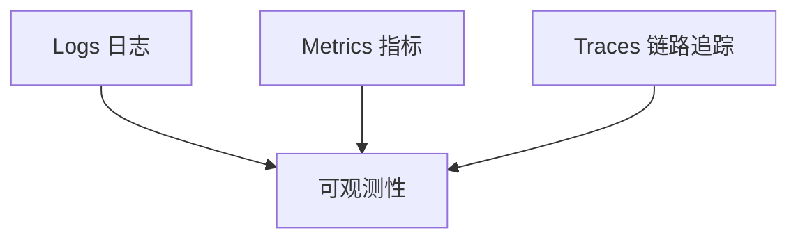

# 可观测性

> 可观测性（Observability）通过日志、指标和追踪三大支柱，使团队能够理解系统内部状态，无需新代码即可诊断问题。

---

## 目录

1. [可观测性基础](#1-可观测性基础)
2. [日志（Logs）](#2-日志logs)
3. [指标（Metrics）](#3-指标metrics)
4. [追踪（Traces）](#4-追踪traces)
5. [OpenTelemetry标准](#5-opentelemetry标准)
6. [告警与SLO](#6-告警与slo)

---

## 1. 可观测性基础

### 1.1 监控 vs 可观测性

| 维度 | 监控 | 可观测性 |
|------|------|----------|
| 范围 | 已知问题 | 未知问题 |
| 方法 | 预定义仪表盘 | 探索式分析 |
| 数据 | 聚合指标 | 高基数事件 |
| 目标 | 告警 | 理解 |

### 1.2 三大支柱



---

## 2. 日志（Logs）

### 2.1 结构化日志

```python
import structlog

logger = structlog.get_logger()
logger.info("order_created",
    order_id="ORD-123456",
    user_id="USR-789",
    amount=99.99,
    currency="CNY"
)
```

### 2.2 日志级别

| 级别 | 用途 | 示例 |
|------|------|------|
| DEBUG | 调试信息 | 请求详情，变量值 |
| INFO | 正常操作 | 请求开始/完成 |
| WARN | 异常但不影响 | 重试，降级 |
| ERROR | 功能受损 | 数据库连接失败 |
| FATAL | 系统崩溃 | 启动失败 |

### 2.3 日志管理栈

```
应用 → 日志采集(Fluentd/Filebeat) → 缓冲(Kafka) → 存储(Elasticsearch/Loki) → 可视化(Kibana/Grafana)
```

**选型对比：**

| 方案 | 存储 | 查询 | 扩展性 |
|------|------|------|--------|
| ELK Stack | Elasticsearch | Lucene | 中 |
| Loki | 对象存储 | LogQL | 好 |
| ClickHouse | 列式存储 | SQL | 好 |

---

## 3. 指标（Metrics）

### 3.1 指标类型

| 类型 | 描述 | 例 |
|------|------|----|
| Counter | 只增不减 | 请求总数 |
| Gauge | 可增可减 | 当前连接数 |
| Histogram | 分布统计 | 请求延迟P50/P99 |
| Summary | 滑动窗口分位数 | 类似Histogram |

### 3.2 Prometheus指标

```python
from prometheus_client import Counter, Histogram, Gauge

# 定义指标
requests_total = Counter('http_requests_total', 'Total requests')
request_duration = Histogram('http_request_duration_seconds', 'Request latency')
active_users = Gauge('active_users', 'Active users')

# 使用
requests_total.inc()
request_duration.observe(0.125)
active_users.set(42)
```

### 3.3 黄金信号

**USE方法：**
- **U**tilization：利用率（CPU 80%）
- **S**aturation：饱和度（队列长度）
- **E**rrors：错误率（5xx比例）

**RED方法：**
- **R**ate：速率（请求/秒）
- **E**rrors：错误数
- **D**uration：持续时间（延迟）

---

## 4. 追踪（Traces）

### 4.1 Trace与Span

```python
Trace: GET /api/orders/123
├── Span: auth_middleware (2ms)
├── Span: get_user (5ms)
├── Span: query_orders (15ms)
│   ├── Span: db_query (12ms)
│   └── Span: cache_lookup (3ms)
└── Span: serialize_response (1ms)
```

### 4.2 Jaeger示意

```
Services:  order-service | user-service | payment-service

Trace: f3a2b1c4 (POST /api/order)
  order-service.create:   12ms  ──────────→  ████████░░░░
  order-service.validate:  3ms  ──→  ████
  user-service.get_user:   5ms  ────→  ██████
  payment-service.charge:  8ms  ──────→  ██████████
  order-service.persist:   2ms  ─→  ██
```

---

## 5. OpenTelemetry标准

### 5.1 统一SDK

OTel 统一了三大信号的采集标准：

```python
from opentelemetry import trace, metrics
from opentelemetry.sdk.trace import TracerProvider
from opentelemetry.exporter.otlp.proto.grpc import OTLPSpanExporter

# 配置
trace.set_tracer_provider(TracerProvider())
tracer = trace.get_tracer(__name__)

# 自动埋点
with tracer.start_as_current_span("process_order") as span:
    span.set_attribute("order_id", order.id)
    span.add_event("inventory_check", {"items": len(order.items)})
    result = process_payment(order)
```

### 5.2 传播与上下文

```
请求头传播：
traceparent: 00-0af7651916cd43dd8448eb211c80319c-b7ad6b7169203331-01
```

---

## 6. 告警与SLO

### 6.1 SLO/SLI/Error Budget

| 概念 | 定义 | 例 |
|------|------|----|
| SLI | 实际指标 | 99.9%请求成功 |
| SLO | 目标值 | 99.9%可用性 |
| Error Budget | 容忍的故障时间 | 0.1% = 8.6h/年 |

### 6.2 告警分级

| 级别 | 响应 | 通知方式 |
|------|------|----------|
| P0 | 立即响应（<15min） | 电话+IM |
| P1 | 快速响应（<1h） | IM |
| P2 | 工作时间响应 | Jira/Ticket |
| P3 | 下次迭代修复 | 排期 |

### 6.3 告警最佳实践

```yaml
# Prometheus 告警规则
groups:
- name: latency
  rules:
  - alert: HighLatency
    expr: |
      histogram_quantile(0.99,
        rate(http_request_duration_seconds_bucket[5m])
      ) > 1
    for: 5m
    labels:
      severity: critical
    annotations:
      summary: "P99 latency > 1s for 5 minutes"
```

---

## 延伸阅读

- *Observability Engineering* (Majors et al.) — 可观测性综合指南
- Prometheus 文档: https://prometheus.io/docs/
- OpenTelemetry 文档: https://opentelemetry.io/docs/
- Grafana 仪表盘: https://grafana.com/grafana/dashboards/
- Google SRE Book: https://sre.google/books/

---

*最后更新：2026-06-15*
