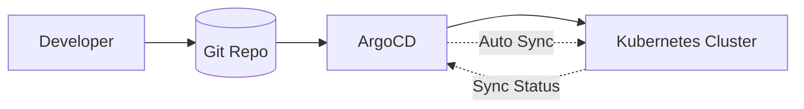

# 云原生应用开发

> 云原生应用开发是利用云计算优势（弹性、可扩展、按需服务）构建和运行应用的方法论，涵盖12-Factor、容器化、编排、持续交付等实践。

---

## 目录

1. [12-Factor应用](#1-12-factor应用)
2. [容器化最佳实践](#2-容器化最佳实践)
3. [持续集成与交付](#3-持续集成与交付)
4. [GitOps](#4-gitops)
5. [云原生设计模式](#5-云原生设计模式)

---

## 1. 12-Factor应用

### 1.1 12因素概览

| 因素 | 原则 | 实践 |
|------|------|------|
| 1. 基准代码 | 一份代码，多环境部署 | Git + 环境配置分离 |
| 2. 依赖 | 显式声明依赖 | requirements.txt, go.mod |
| 3. 配置 | 配置在环境中 | 环境变量，ConfigMap |
| 4. 后端服务 | 视为附加资源 | 连接字符串，服务发现 |
| 5. 构建发布运行 | 严格分离阶段 | CI：构建 → CD：发布/运行 |
| 6. 进程 | 无状态进程 | 共享状态用外部服务 |
| 7. 端口绑定 | 服务自包含 | HTTP直接暴露 |
| 8. 并发 | 进程模型扩展 | 水平扩展 |
| 9. 易处理 | 快速启停，优雅退出 | SIGTERM处理 |
| 10. 开发生产一致 | 环境差异最小化 | 容器化，Dev/Prod一致 |
| 11. 日志 | 日志是事件流 | stdout/stderr |
| 12. 管理进程 | 一次性管理脚本 | DB迁移，数据修复 |

### 1.2 无状态设计

```python
# ❌ 有状态：本地存储会话
class SessionStore:
    def __init__(self):
        self.sessions = {}  # 进程内存

# ✅ 无状态：外部存储
class SessionStore:
    def __init__(self, redis):
        self.redis = redis  # 共享外部存储
```

---

## 2. 容器化最佳实践

### 2.1 Dockerfile最佳实践

```dockerfile
# 1. 多阶段构建
FROM golang:1.22 AS builder
WORKDIR /app
COPY go.mod go.sum ./
RUN go mod download
COPY . .
RUN CGO_ENABLED=0 go build -o app

FROM alpine:3.19
RUN apk add --no-cache ca-certificates
COPY --from=builder /app/app /app
USER 10001
EXPOSE 8080
ENTRYPOINT ["/app"]

# 2. 使用非root用户
# 3. 最小化基础镜像
# 4. 缓存依赖层
```

### 2.2 镜像优化

| 策略 | 效果 |
|------|------|
| Alpine/Distroless基础镜像 | 减少90%+体积 |
| 多阶段构建 | 运行时不含构建工具 |
| .dockerignore | 减少构建上下文 |
| 依赖层缓存 | 加速CI构建 |
| 层合并（多RUN合并） | 减少层数 |

---

## 3. 持续集成与交付

### 3.1 CI/CD流水线

```yaml
# GitHub Actions 示例
name: CI/CD
on:
  push:
    branches: [main]
jobs:
  test:
    runs-on: ubuntu-latest
    steps:
    - uses: actions/checkout@v4
    - name: Run tests
      run: make test
  build:
    needs: test
    steps:
    - name: Build & Push
      run: |
        docker build -t myapp:${{ github.sha }} .
        docker push myapp:${{ github.sha }}
  deploy:
    needs: build
    steps:
    - name: Deploy to K8s
      run: kubectl set image deployment/myapp myapp=myapp:${{ github.sha }}
```

### 3.2 GitOps with ArgoCD

Git仓库作为单一事实来源：



---

## 4. GitOps

### 4.1 GitOps核心原则

1. **声明式**：系统状态在Git中声明
2. **版本控制**：所有变更可追溯
3. **自动同步**：集群自动收敛到Git状态
4. **自愈**：手动修改会被自动恢复

### 4.2 工具对比

| 工具 | 平台 | 特点 |
|------|------|------|
| ArgoCD | K8s | 功能丰富，UI强大 |
| Flux | K8s | 轻量，CNCF |
| Jenkins X | K8s | CI+CD一体化 |
| GitLab CI | GitLab | 内置Registry |

---

## 5. 云原生设计模式

### 5.1 模式对比

| 模式 | 描述 | 应用场景 |
|------|------|---------|
| Sidecar | 主容器+辅助容器 | 日志采集，代理 |
| Ambassador | 代理外部访问 | 连接池，重试 |
| Adapter | 标准化输出 | 监控适配 |
| 断路器 | 故障隔离 | 下游依赖保护 |
| 重试+退避 | 临时故障恢复 | 网络请求 |
| 背压 | 流量控制 | 防止过载 |
| 健康检查 | 就绪/存活探针 | K8s Pod管理 |

### 5.2 Ambassador模式

```yaml
apiVersion: v1
kind: Pod
spec:
  containers:
  - name: app
    image: myapp:1.0
  - name: redis-ambassador
    image: redis-ambassador:1.0
    env:
    - name: REDIS_URL
      value: redis://redis-cluster:6379
```

---

## 延伸阅读

- 12-Factor App: https://12factor.net/
- *Cloud Native Patterns* (Cornelia Davis) — 云原生设计模式
- *Kubernetes Patterns* (Ibryam & Huß) — K8s设计模式
- GitOps 指南: https://www.gitops.tech/
- CNCF Landscape: https://landscape.cncf.io/

---

*最后更新：2026-06-15*
