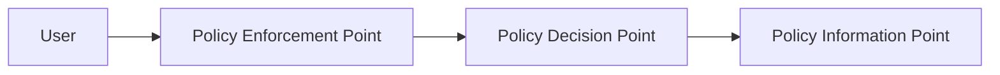

# 零信任架构

> 零信任（Zero Trust）的核心原则是"永不信任，始终验证"，不再假设网络内部是安全的。

---

## 1. 核心原则

| 原则 | 描述 |
|------|------|
| 始终验证 | 每个请求都认证和授权 |
| 最小权限 | 只授予完成任务所需权限 |
| 假设侵害 | 假设已被入侵，持续监控 |

## 2. 零信任架构组件



| 组件 | 功能 |
|------|------|
| PEP | 策略执行点（网关/代理） |
| PDP | 策略决策点（评估策略） |
| PIP | 策略信息点（上下文数据） |

## 3. 实施路径

```
阶段1: 身份先行 → 阶段2: 设备可信 → 阶段3: 网络微分段 → 阶段4: 持续监控
```

**关键技术：**
- IAM + MFA
- 终端设备合规
- 微分段（NSX/Cilium）
- 实时行为分析（UEBA）

*最后更新：2026-06-15*
