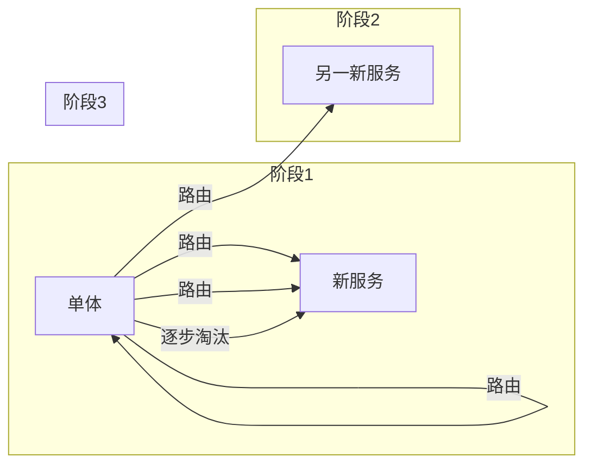

# 单体到微服务迁移

> 单体应用到微服务的迁移是渐进的过程，不应一次性重写，而应采取绞杀者模式逐步替换。

---

## 1. 迁移路径

```
评估 → 边界识别 → 基础设施准备 → 逐步拆分 → 持续优化
```

### 1.1 何时应该拆分

| 信号 | 严重程度 |
|------|----------|
| 单次部署影响全系统 | ⚠️⚠️⚠️ |
| 团队间频繁冲突 | ⚠️⚠️⚠️ |
| 部分功能需要独立扩缩 | ⚠️⚠️ |
| 技术栈限制 | ⚠️⚠️ |
| 发布周期缓慢 | ⚠️ |

### 1.2 绞杀者模式



---

## 2. 拆分策略

| 方法 | 描述 | 风险 |
|------|------|------|
| 按业务能力 | 按领域划分 | 边界误判 |
| 按功能模块 | 按模块拆分 | 事务边界 |
| 按数据域 | 按数据归属 | 数据一致性 |
| 按变更频率 | 高频变动独立 | 依赖关系 |

## 3. 典型迁移案例

### 电商系统

```
单体(用户/商品/订单/支付/库存)
    ↓
用户服务 | 商品服务 | 订单服务 | 支付服务 | 库存服务
```

**关键步骤：**
1. 先拆分无状态的用户和商品服务
2. 再拆分订单（涉及分布式事务）
3. 最后拆分支付（安全要求最高）

*最后更新：2026-06-15*
