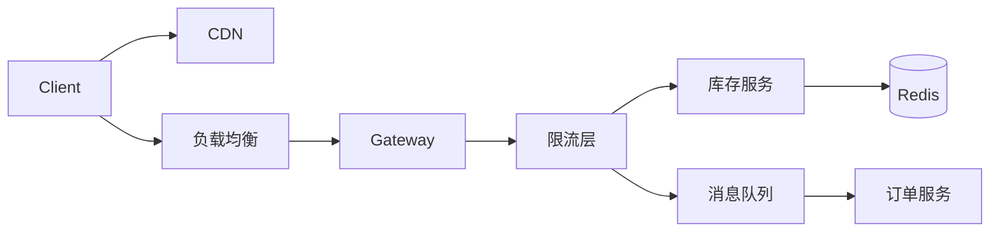

# 大规模分布式系统设计

> 大规模分布式系统需关注扩展性、可用性、一致性和可维护性，典型案例如电商秒杀、社交Feed、实时推荐等。

---

## 1. 设计方法论

### 1.1 设计流程

```
需求分析 → 流量估算 → 数据建模 → 架构设计 → 方案评审 → 迭代优化
```

### 1.2 流量估算

| 指标 | 估算方法 |
|------|---------|
| QPS | 日活 × 每人请求量 / 86400 |
| 存储 | 每日新增 × 保留天数 |
| 带宽 | 响应大小 × QPS |
| 并发连接 | QPS × 平均延迟 |

```python
# 电商系统流量估算
DAU = 1000_0000        # 1000万日活
requests_per_user = 10  # 每人10次
peak_ratio = 5          # 峰值比例

daily_requests = DAU * requests_per_user
avg_qps = daily_requests / 86400
peak_qps = avg_qps * peak_ratio

print(f"日均请求: {daily_requests/1e8:.1f}亿")
print(f"平均QPS: {avg_qps:.0f}")
print(f"峰值QPS: {peak_qps:.0f}")
```

---

## 2. 经典架构模式

### 2.1 秒杀系统



| 技术 | 作用 |
|------|------|
| 前端限流 | 按钮置灰+验证码 |
| 链路限流 | 令牌桶+漏斗 |
| 库存预热 | Redis预减 |
| 异步下单 | MQ削峰 |
| 本地标记 | JVM缓存 |

### 2.2 社交Feed系统

**推模式（Fan-out on Write）：**
- 发帖时写入所有粉丝的收件箱
- 读：O(1)
- 写：O(followers)

**拉模式（Fan-out on Read）：**
- 读时聚合关注列表的帖子
- 读：O(following)
- 写：O(1)

**混合模式：** 大V拉 + 普通用户推

---

## 3. 数据一致性方案

| 场景 | 方案 | 说明 |
|------|------|------|
| 最终一致 | MQ+补偿 | 订单状态同步 |
| 强一致 | 2PC/TCC | 账户扣款 |
| 读写分离 | CQRS | 报表查询 |
| 去重 | 幂等表 | 支付回调 |

*最后更新：2026-06-15*
