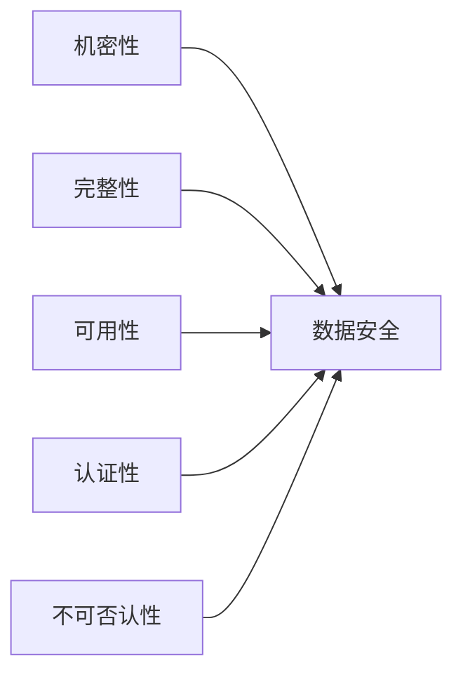

# 第十四章：密码学与安全

> 密码学是保护信息的科学，从古代凯撒密码到现代公钥加密和零知识证明，密码学是数字安全的基石。

---

## 目录

1. [密码学基础](#1-密码学基础)
2. [对称加密](#2-对称加密)
3. [非对称加密](#3-非对称加密)
4. [哈希函数与数字签名](#4-哈希函数与数字签名)
5. [密钥交换协议](#5-密钥交换协议)
6. [前沿密码学](#6-前沿密码学)

---

## 1. 密码学基础

### 1.1 核心概念

| 术语 | 定义 |
|------|------|
| 明文 | 原始可读信息 |
| 密文 | 加密后的不可读信息 |
| 加密 | 明文 → 密文的过程 |
| 解密 | 密文 → 明文的过程 |
| 密钥 | 控制加密/解密的参数 |

### 1.2 柯克霍夫原则

> 密码系统应保持安全，即使除密钥外的所有细节都公开。

### 1.3 安全目标



---

## 2. 对称加密

### 2.1 流密码

逐字节加密，典型：RC4、ChaCha20。

$$\text{密文} = \text{明文} \oplus \text{密钥流}$$

### 2.2 分组密码

将明文分块加密。

**AES（高级加密标准）：**
- 块大小：128 bit
- 密钥长度：128/192/256 bit
- 轮数：10/12/14

```
AES-128 加密流程（简化）：
明文块 → AddRoundKey → [SubBytes → ShiftRows → MixColumns → AddRoundKey] × 9 → SubBytes → ShiftRows → AddRoundKey → 密文块
```

### 2.3 分组模式

| 模式 | 描述 | 特性 |
|------|------|------|
| ECB | 每块独立加密 | 简单但不安全（相同明文块→相同密文块） |
| CBC | 每块与前一密文块异或 | 需IV，不能并行 |
| CTR | 加密计数器值 | 可并行，随机访问 |
| GCM | CTR + GMAC认证 | 同时提供认证，推荐 |

### 2.4 AES-CBC Python示例

```python
from cryptography.fernet import Fernet

# 使用更高级的Fernet（AES-CBC + HMAC）
key = Fernet.generate_key()
f = Fernet(key)
token = f.encrypt(b"Hello, cryptography!")
print(f.decrypt(token))  # b"Hello, cryptography!"
```

---

## 3. 非对称加密

### 3.1 RSA 算法

**密钥生成：**
1. 选择大素数 $p, q$
2. $n = p \times q$
3. $\phi(n) = (p-1)(q-1)$
4. 选择 $e$ 使得 $1 < e < \phi(n)$ 且 $\gcd(e, \phi(n)) = 1$
5. $d \equiv e^{-1} \pmod{\phi(n)}$
6. 公钥：$(n, e)$，私钥：$(n, d)$

**加密/解密：**
$$c \equiv m^e \pmod{n}, \quad m \equiv c^d \pmod{n}$$

**安全性基础：** 大整数分解的困难性。

### 3.2 椭圆曲线密码学（ECC）

**椭圆曲线方程：** $y^2 = x^3 + ax + b$

**核心操作：** 点加法 + 标量乘法

$$Q = k \times G \quad (G\text{为基点}, k\text{为私钥}, Q\text{为公钥})$$

**安全性：** 椭圆曲线离散对数问题（ECDLP）。

### 3.3 RSA vs ECC

| 特性 | RSA | ECC |
|------|-----|-----|
| 安全性基础 | 大整数分解 | 椭圆曲线离散对数 |
| 同安全强度密钥长度 | 3072 bit | 256 bit |
| 速度（签名/解密） | 较慢 | 较快 |
| 速度（验证/加密） | 较快 | 较慢 |
| 典型应用 | 传统系统/证书 | 现代系统/移动端 |

---

## 4. 哈希函数与数字签名

### 4.1 哈希函数

**属性：**
- 抗原像：给定 $y$，找 $x$ 使 $H(x)=y$ 不可行
- 抗第二原像：给定 $x$，找 $x' \neq x$ 使 $H(x')=H(x)$ 不可行
- 抗碰撞：找任意 $x \neq x'$ 使 $H(x)=H(x')$ 不可行

**常见哈希算法：**

| 算法 | 输出长度 | 安全性状态 |
|------|----------|------------|
| MD5 | 128 bit | 已破解（碰撞） |
| SHA-1 | 160 bit | 已破解 |
| SHA-256 | 256 bit | 安全（推荐） |
| SHA-3 | 可变 | 安全（最新标准） |

```python
import hashlib

data = b"Hello, cryptography!"
print(hashlib.sha256(data).hexdigest())
```

### 4.2 数字签名

**过程：**
1. 签名者用私钥对消息哈希签名
2. 验证者用公钥验证签名

```python
from cryptography.hazmat.primitives import hashes
from cryptography.hazmat.primitives.asymmetric import rsa, padding

# 生成密钥对
private_key = rsa.generate_private_key(65537, 2048)
public_key = private_key.public_key()

# 签名
message = b"Important message"
signature = private_key.sign(message, padding.PSS(mgf=padding.MGF1(hashes.SHA256()), salt_length=padding.PSS.MAX_LENGTH), hashes.SHA256())

# 验证
public_key.verify(signature, message, padding.PSS(mgf=padding.MGF1(hashes.SHA256()), salt_length=padding.PSS.MAX_LENGTH), hashes.SHA256())
```

### 4.3 数字证书（X.509）

```
证书内容：
├── 版本号
├── 序列号
├── 签名算法
├── 颁发者（CA）
├── 有效期
├── 主体（证书所有者）
├── 公钥信息
└── CA的数字签名
```

---

## 5. 密钥交换协议

### 5.1 Diffie-Hellman 密钥交换

```
Alice                    Bob
   |                       |
   |--- a = g^a mod p ---->|
   |                       |
   |<--- b = g^b mod p ----|
   |                       |
   s = b^a mod p        s = a^b mod p
   |                       |
   s = g^(ab) mod p (共同密钥)
```

### 5.2 TLS 握手（简化）

```
客户端                         服务器
   |                             |
   |--- ClientHello ------------>|
   |<--- ServerHello + Cert ----|
   |--- 密钥交换 ---------------->|
   |<--- Finished --------------|
   |--- Finished --------------->|
   |                             |
   |======= 加密通信 ============|
```

---

## 6. 前沿密码学

### 6.1 零知识证明（ZKP）

证明者向验证者证明知道某个秘密，而不泄露秘密本身。

**应用：** Zcash匿名交易、zk-Rollup扩容、身份认证。

### 6.2 同态加密

在加密数据上直接计算，结果解密后等于对明文计算的结果。

$$\text{Enc}(a) \oplus \text{Enc}(b) = \text{Enc}(a+b)$$

### 6.3 后量子密码学

量子计算机威胁RSA/ECC的安全性，NIST正在标准化后量子算法：

| 算法 | 类型 | 安全性基础 |
|------|------|------------|
| CRYSTALS-Kyber | KEM | 格密码（Module-LWE） |
| CRYSTALS-Dilithium | 签名 | 格密码 |
| FALCON | 签名 | 格密码 |
| SPHINCS+ | 签名 | 哈希签名 |

---

## 延伸阅读

- *Handbook of Applied Cryptography* (Menezes et al.) — 密码学手册
- *Introduction to Modern Cryptography* (Katz & Lindell) — 现代密码学教材
- Cryptography Python 库: `cryptography`, `pycryptodome`
- NIST 后量子密码学项目: https://csrc.nist.gov/projects/post-quantum-cryptography

---

*最后更新：2026-06-15*
